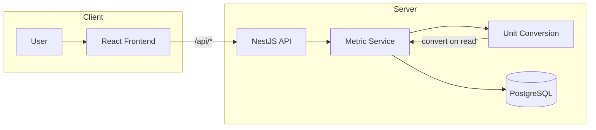
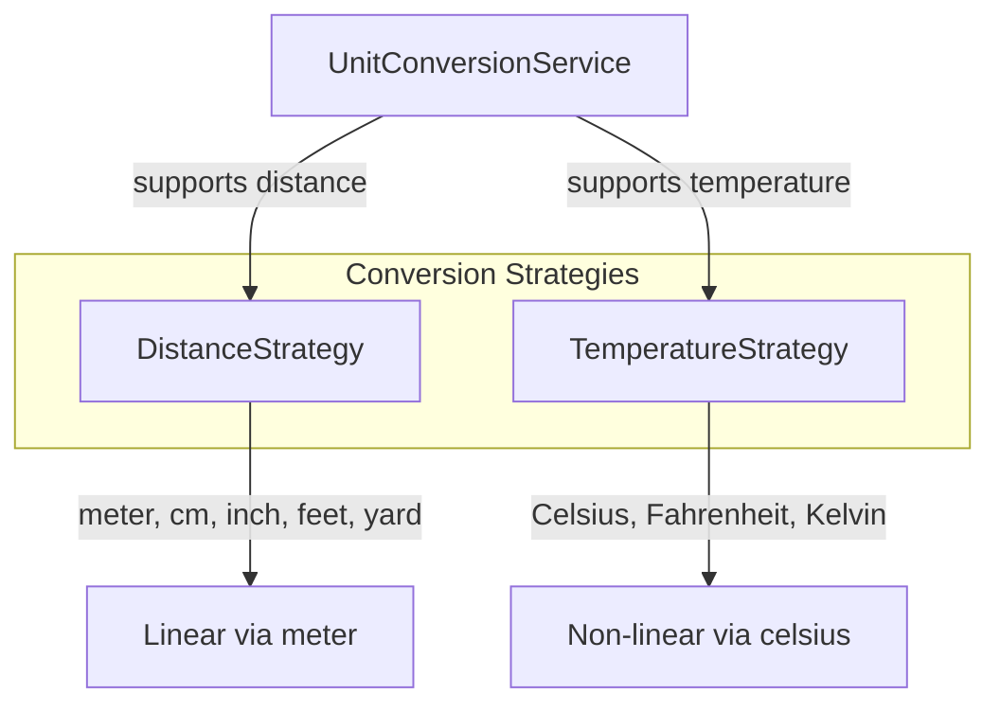

# Metric Tracking System — Everfit Node.js Assignment

[](https://nestjs.com/)
[](https://typeorm.io/)
[](https://www.postgresql.org/)
[](https://www.typescriptlang.org/)

---

### Live Demo & Links

- **Live Demo:** [https://everfit.bytelucas.site/](https://everfit.bytelucas.site/)
- **API Docs (Swagger):** [https://everfit-api.bytelucas.site/docs](https://everfit-api.bytelucas.site/docs)
- **GitHub:** [https://github.com/bytelucas/Hieu-Nguyen](https://github.com/bytelucas/Hieu-Nguyen)

Frontend and backend share the same domain (Nginx reverse proxy `/api` → backend).

---

## Table of Contents

- [Architecture Overview](#architecture-overview)
- [Assignment Overview](#assignment-overview)
- [Implementation Summary](#implementation-summary)
- [API Endpoints](#api-endpoints)
- [Project Structure](#project-structure)
- [Frontend POC](#frontend-poc)
- [Deployment](#deployment)
- [Local Development](#local-development)

---

## Architecture Overview



---

## Assignment Overview

This project implements the **Everfit Node.js Assignment** — a Metric Tracking System that supports different units.

**Metric types:**
- **Distance:** meter, centimeter, inch, feet, yard
- **Temperature:** °C, °F, °K

**Functional requirements:**
- Add a new metric with: Date, Value, Unit
- Retrieve a list of all metrics by type (Distance / Temperature)
- Chart data: use the latest metric entry per day, filter by type, filter by time period (e.g. 1 month, 2 months)
- When a specific unit is provided in API calls, the system converts and returns values in that unit

**Constraints:** No authentication. The user passes `userId` via header `x-user-id` for grouping and querying data.

---

## Implementation Summary

- **Backend:** NestJS 11 + TypeORM + PostgreSQL
- **Unit conversion:** Strategy pattern — each metric type has its own conversion strategy. See [docs/14-03-2026/metric.md](docs/14-03-2026/metric.md) for details.
- **Schema:** Simple — store original `value` + `unit`; conversion happens at read time in the application layer.
- **Validation:** class-validator (unit enum, value > 0, date not in future)

### Unit Conversion — Strategy Pattern



---

## API Endpoints

| Method | Path | Description |
|--------|------|-------------|
| POST | `/api/v1/metrics` | Add metric (body: `date`, `value`, `unit`) |
| GET | `/api/v1/metrics` | List by type, optional `unit` conversion (query: `type`, `unit`) |
| GET | `/api/v1/metrics/cursor` | List with cursor pagination |
| GET | `/api/v1/metrics/chart` | Chart data — latest entry per day (query: `type`, `period`, `unit`) |

**Header:** `x-user-id` required on all requests.

---

## Project Structure

- `src/app/` — App module, filters
- `src/common/` — Database, pagination, response, unit-conversion (Strategy pattern)
- `src/configs/` — Config
- `src/modules/metric/` — Metric module (controller, service, repository, DTOs, entity)
- `src/router/` — Route registration
- `docs/` — Implementation notes

---

## Frontend POC

A React + Vite + Recharts UI is provided for visual tracking:
- Add metric form
- List metrics by type with unit conversion
- Chart by period (1–2 months)
- Cursor pagination demo

Deployed alongside the backend on the same domain.

---

## Deployment

- **CI/CD:** GitHub Actions — build server + client, deploy via SSH/SCP to VPS
- **Runtime:** PM2
- **Infrastructure:** Server and client share domain; Nginx reverse proxy routes `/api` to backend

---

## Local Development

### Requirements

- Node.js >= 18
- PostgreSQL
- pnpm

### Run Backend (API)

```bash
cd server
pnpm install
cp .env.example .env   # Edit .env with your PostgreSQL config
pnpm start:dev
```

API runs at `http://localhost:3000`. Swagger docs: `http://localhost:3000/docs`

### Run Frontend (Client)

```bash
cd client
pnpm install
pnpm dev
```

Client runs at `http://localhost:5173`. Vite proxies `/api` to `localhost:3000`, so the UI talks to the local backend.
